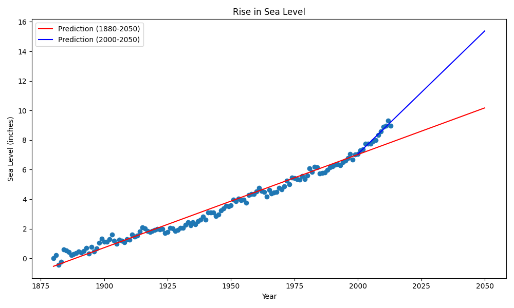

# sea_level_predictor

import pandas as pd
import matplotlib.pyplot as plt
from scipy.stats import linregress # Used for linear regression
import numpy as np # Used for np.arange

def draw_plot():
    """
    Analyzes global average sea level change data, creates a scatter plot,
    and plots two lines of best fit to predict sea level change.

    Returns:
        matplotlib.figure.Figure: The Matplotlib Figure object containing the plot.
    """
    # 1. Use Pandas to import the data from epa-sea-level.csv.
    df = pd.read_csv('epa-sea-level.csv')

    # Create scatter plot using the 'Year' column as the x-axis
    # and 'CSIRO Adjusted Sea Level' as the y-axis.
    fig, ax = plt.subplots(figsize=(10, 6)) # Create a figure and a set of subplots (axes)
    ax.scatter(df['Year'], df['CSIRO Adjusted Sea Level'])

    # 2. Use the linregress function from scipy.stats to get the slope and y-intercept
    # of the line of best fit for ALL data.
    res_all = linregress(df['Year'], df['CSIRO Adjusted Sea Level'])
    
    # Plot the line of best fit over the scatter plot.
    # Make the line go through the year 2050 to predict the sea level rise in 2050.
    # Create a range of years from the start of the data to 2050 for prediction.
    x_predict_all = np.arange(df['Year'].min(), 2051) # Range includes 2050
    # Calculate predicted y-values using the linear regression equation (y = mx + b).
    y_predict_all = res_all.slope * x_predict_all + res_all.intercept
    # Plot the line (red color for clarity)
    ax.plot(x_predict_all, y_predict_all, color='red', label='Prediction (1880-2050)')

    # 3. Plot a new line of best fit just using the data from year 2000 through the most recent year in the dataset.
    # Filter the DataFrame for data from year 2000 onwards.
    df_2000 = df[df['Year'] >= 2000]
    
    # Get slope and y-intercept for this filtered data.
    res_2000 = linregress(df_2000['Year'], df_2000['CSIRO Adjusted Sea Level'])
    
    # Make the line also go through the year 2050 to predict the sea level rise in 2050
    # if the rate of rise continues as it has since the year 2000.
    # Create a range of years from 2000 to 2050 for this prediction.
    x_predict_2000 = np.arange(2000, 2051)
    # Calculate predicted y-values.
    y_predict_2000 = res_2000.slope * x_predict_2000 + res_2000.intercept
    # Plot the line (blue color for clarity)
    ax.plot(x_predict_2000, y_predict_2000, color='blue', label='Prediction (2000-2050)')

    # 4. Set labels and title.
    ax.set_xlabel('Year') # Set x-axis label
    ax.set_ylabel('Sea Level (inches)') # Set y-axis label
    ax.set_title('Rise in Sea Level') # Set the main title

    # Add a legend to differentiate the lines
    ax.legend()
    
    # Ensure tight layout (adjusts plot parameters for a tight layout)
    plt.tight_layout()

    # Save plot and return figure object
    # Do not modify the next two lines (as per boilerplate instructions)
    plt.savefig('sea_level_plot.png') # Saves the plot to a file
    return fig

# --- Example Usage (for local testing purposes, typically in main.py) ---
# This part of the code will only run if the script is executed directly (not imported as a module).
# Make sure 'epa-sea-level.csv' is in the same directory as this script.
if __name__ == "__main__":
    try:
        print("Generating sea level prediction plot...")
        # Call the function to draw the plot
        plot_figure = draw_plot()
        
        # Display the plot (optional, depending on your environment and matplotlib backend)
        plt.show() 
        print("Plot generated and saved as 'sea_level_plot.png'")

    except FileNotFoundError:
        print("Error: 'epa-sea-level.csv' not found. Please make sure the dataset file is in the same directory as the script.")
        print("You can download it from: https://raw.githubusercontent.com/freeCodeCamp/boilerplate-sea-level-predictor/main/epa-sea-level.csv")
    except Exception as e:
        print(f"An unexpected error occurred: {e}.")
        print("Please check your 'epa-sea-level.csv' file for formatting issues or missing data.")
